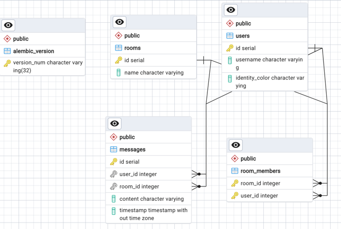

<p align="center">
  
</p>
<p align="center">
    <h1 align="center">CHAT_ROOM</h1>
</p>
<p align="center">
    <em><code>An interactive chat application built using FastAPI for the backend and Next.js for the frontend.</code></em>
</p>
<p align="center">
	
	
	
	
<p>
<p align="center">
	<!-- default option, no dependency badges. -->
</p>

<br><!-- TABLE OF CONTENTS -->
<details>
  <summary>Table of Contents</summary><br>

- [Overview](#overview)
- [Features](#features)
- [Repository Structure](#repository-structure)
- [Modules](#modules)
- [Getting Started](#getting-started)
    - [Installation](#installation)
    - [Usage](#usage)
    - [Tests](#tests)
- [Project Roadmap](#project-roadmap)
- [Contributing](#contributing)
- [License](#license)
- [Acknowledgments](#acknowledgments)
</details>
<hr>

## Overview

`chat_room` is an interactive chat application designed to facilitate real-time communication between users. The backend is powered by FastAPI, providing a robust and high-performance API. The frontend is built using Next.js, offering a responsive and dynamic user interface.

---

## Features

- **Real-time Messaging**: Enables users to send and receive messages instantly.
- **Room Management**: Create and join chat rooms.
- **Message Persistence**: Store and retrieve messages from a database.
- **Responsive Design**: Accessible on both desktop and mobile devices.

---

## Repository Structure

```sh
└── chat_room/
    ├── Dockerfile
    ├── LICENSE
    ├── README.md
    ├── app
    │   ├── __init__.py
    │   ├── alembic
    │   ├── alembic.ini
    │   ├── database
    │   │   ├── __init__.py
    │   │   └── postgres.py
    │   ├── main.py
    │   ├── models
    │   │   ├── __init__.py
    │   │   ├── message.py
    │   │   ├── room_member.py
    │   │   ├── room.py
    │   │   └── user.py
    │   ├── requirments.txt
    │   ├── routes
    │   │   ├── __init__.py
    │   │   ├── message.py
    │   │   ├── room.py
    │   │   ├── user.py
    │   │   └── websocket.py
    │   ├── schemas.py
    │   ├── services
    │   │   ├── __init__.py
    │   │   ├── message.py
    │   │   ├── room.py
    │   │   └── user.py
    │   └── test_app.py
    ├── blueprint.md
    ├── docker-compose.yml
    ├── frontend
    │   ├── .eslintrc.json
    │   ├── .gitignore
    │   ├── README.md
    │   ├── components.json
    │   ├── next.config.mjs
    │   ├── package-lock.json
    │   ├── package.json
    │   ├── postcss.config.mjs
    │   ├── public
    │   ├── src
    │   │   ├── app
    │   │   │   ├── globals.css
    │   │   │   └── layout.tsx
    │   │   ├── components
    │   │   │   ├── AlertsComponent.tsx
    │   │   │   ├── room
    │   │   │   │   ├── RoomComponent.tsx
    │   │   │   │   ├── RoomMessageComponent.tsx
    │   │   │   ├── ui
    │   │   │   │   ├── alert.tsx
    │   │   │   │   ├── button.tsx
    │   │   │   │   ├── card.tsx
    │   │   │   │   ├── toast.tsx
    │   │   │   │   ├── toaster.tsx
    │   │   │   │   └── use-toast.ts
    │   │   │   ├── users
    │   │   │   │   └── SignupComponent.tsx
    │   │   ├── hooks
    │   │   │   └── webSocket.tsx
    │   │   ├── lib
    │   │   │   ├── userStorage.ts
    │   │   │   └── utils.ts
    │   │   ├── pages
    │   │   │   ├── _app.tsx
    │   │   │   ├── index.tsx
    │   │   │   ├── room.tsx
    │   │   │   └── rooms
    │   │   │       └── [roomId].tsx
    │   │   └── services
    │   │       ├── roomService.ts
    │   │       └── userService.ts
    │   ├── tailwind.config.ts
    │   └── tsconfig.json
    ├── next.Dockerfile
    ├── package-lock.json
    └── package.json

```

## Modules

<details closed><summary>.</summary>

| File                                                                                       | Summary                                                  |
| ---                                                                                        | ---                                                      |
| [Dockerfile](https://github.com/amworden/chat_room/blob/master/Dockerfile)                 | Docker configuration for backend containerization.       |
| [package-lock.json](https://github.com/amworden/chat_room/blob/master/package-lock.json)   | Auto-generated file that locks versions of dependencies. |
| [package.json](https://github.com/amworden/chat_room/blob/master/package.json)             | Lists the project's dependencies and scripts.            |
| [docker-compose.yml](https://github.com/amworden/chat_room/blob/master/docker-compose.yml) | Docker Compose configuration for multi-container setup.  |
| [next.Dockerfile](https://github.com/amworden/chat_room/blob/master/next.Dockerfile)       | Docker configuration for frontend containerization.      |

</details>

<details closed><summary>app</summary>

| File                                                                                     | Summary                                                  |
| ---                                                                                      | ---                                                      |
| [schemas.py](https://github.com/amworden/chat_room/blob/master/app/schemas.py)           | Defines Pydantic models for data validation.             |
| [requirments.txt](https://github.com/amworden/chat_room/blob/master/app/requirments.txt) | Lists the Python dependencies.                           |
| [main.py](https://github.com/amworden/chat_room/blob/master/app/main.py)                 | Entry point for the FastAPI application.                 |
| [test_app.py](https://github.com/amworden/chat_room/blob/master/app/test_app.py)         | Contains test cases for the application.                 |

</details>

<details closed><summary>app.database</summary>

| File                                                                                      | Summary                                                  |
| ---                                                                                       | ---                                                      |
| [postgres.py](https://github.com/amworden/chat_room/blob/master/app/database/postgres.py) | Configures the connection to the PostgreSQL database.    |

</details>

<details closed><summary>app.models</summary>

| File                                                                                          | Summary                                                  |
| ---                                                                                           | ---                                                      |
| [user.py](https://github.com/amworden/chat_room/blob/master/app/models/user.py)               | SQLAlchemy model for user data.                          |
| [message.py](https://github.com/amworden/chat_room/blob/master/app/models/message.py)         | SQLAlchemy model for message data.                       |
| [room_member.py](https://github.com/amworden/chat_room/blob/master/app/models/room_member.py) | SQLAlchemy model for room membership data.               |
| [room.py](https://github.com/amworden/chat_room/blob/master/app/models/room.py)               | SQLAlchemy model for room data.                          |

</details>

<details closed><summary>app.alembic</summary>

| File                                                                                           | Summary                                                  |
| ---                                                                                            | ---                                                      |
| [script.py.mako](https://github.com/amworden/chat_room/blob/master/app/alembic/script.py.mako) | Template for Alembic migration scripts.                  |
| [env.py](https://github.com/amworden/chat_room/blob/master/app/alembic/env.py)                 | Alembic environment configuration.                       |

</details>

<details closed><summary>app.alembic.versions</summary>

| File                                                                                                                                                                                  | Summary                                                  |
| ---                                                                                                                                                                                   | ---                                                      |
| [d9a352f861be_update_models_with_relationships_and_.py](https://github.com/amworden/chat_room/blob/master/app/alembic/versions/d9a352f861be_update_models_with_relationships_and_.py) | Migration script for model updates.                      |
| [ecb8a57150aa_initial_migration.py](https://github.com/amworden/chat_room/blob/master/app/alembic/versions/ecb8a57150aa_initial_migration.py)                                         | Initial migration script.                                |

</details>

<details closed><summary>app.routes</summary>

| File                                                                                      | Summary                                                  |
| ---                                                                                       | ---                                                      |
| [user.py](https://github.com/amworden/chat_room/blob/master/app/routes/user.py)           | API routes for user operations.                          |
| [message.py](https://github.com/amworden/chat_room/blob/master/app/routes/message.py)     | API routes for message operations.                       |
| [room.py](https://github.com/amworden/chat_room/blob/master/app/routes/room.py)           | API routes for room operations.                          |
| [websocket.py](https://github.com/amworden/chat_room/blob/master/app/routes/websocket.py) | API routes for WebSocket connections.                    |

</details>

<details closed><summary>app.services</summary>

| File                                                                                    | Summary                                                  |
| ---                                                                                     | ---                                                      |
| [user.py](https://github.com/amworden/chat_room/blob/master/app/services/user.py)       | Service logic for user operations.                       |
| [message.py](https://github.com/amworden/chat_room/blob/master/app/services/message.py) | Service logic for message operations.                    |
| [room.py](https://github.com/amworden/chat_room/blob/master/app/services/room.py)       | Service logic for room operations.                       |

</details>

<details closed><summary>frontend</summary>

| File                                                                                                | Summary                                                  |
| ---                                                                                                 | ---                                                      |
| [postcss.config.mjs](https://github.com/amworden/chat_room/blob/master/frontend/postcss.config.mjs) | PostCSS configuration.                                   |
| [next.config.mjs](https://github.com/amworden/chat_room/blob/master/frontend/next.config.mjs)       | Next.js configuration.                                   |
| [tailwind.config.ts](https://github.com/amworden/chat_room/blob/master/frontend/tailwind.config.ts) | Tailwind CSS configuration.                              |
| [package-lock.json](https://github.com/amworden/chat_room/blob/master/frontend/package-lock.json)   | Auto-generated file that locks versions of dependencies. |
| [package.json](https://github.com/amworden/chat_room/blob/master/frontend/package.json)             | Lists the project's dependencies and scripts.            |
| [components.json](https://github.com/amworden/chat_room/blob/master/frontend/components.json)       | Component configuration file.                            |
| [tsconfig.json](https://github.com/amworden/chat_room/blob/master/frontend/tsconfig.json)           | TypeScript configuration.                                |
| [.eslintrc.json](https://github.com/amworden/chat_room/blob/master/frontend/.eslintrc.json)         | ESLint configuration.                                    |

</details>

<details closed><summary>frontend.src.app</summary>

| File                                                                                          | Summary                                                  |
| ---                                                                                           | ---                                                      |
| [layout.tsx](https://github.com/amworden/chat_room/blob/master/frontend/src/app/layout.tsx)   | Layout component for the application.                    |
| [globals.css](https://github.com/amworden/chat_room/blob/master/frontend/src/app/globals.css) | Global CSS styles.                                       |

</details>

<details closed><summary>frontend.src.components</summary>

| File                                                                                                                 | Summary                                                  |
| ---                                                                                                                  | ---                                                      |
| [AlertsComponent.tsx](https://github.com/amworden/chat_room/blob/master/frontend/src/components/AlertsComponent.tsx) | Component for displaying alerts.                         |

</details>

<details closed><summary>frontend.src.components.ui</summary>

| File                                                                                                      | Summary                                                  |
| ---                                                                                                       | ---                                                      |
| [card.tsx](https://github.com/amworden/chat_room/blob/master/frontend/src/components/ui/card.tsx)         | UI component for displaying cards.                       |
| [toaster.tsx](https://github.com/amworden/chat_room/blob/master/frontend/src/components/ui/toaster.tsx)   | UI component for displaying toasts.                      |
| [alert.tsx](https://github.com/amworden/chat_room/blob/master/frontend/src/components/ui/alert.tsx)       | UI component for displaying alerts.                      |
| [use-toast.ts](https://github.com/amworden/chat_room/blob/master/frontend/src/components/ui/use-toast.ts) | Hook for managing toasts.                                |
| [button.tsx](https://github.com/amworden/chat_room/blob/master/frontend/src/components/ui/button.tsx)     | UI component for buttons.                                |
| [toast.tsx](https://github.com/amworden/chat_room/blob/master/frontend/src/components/ui/toast.tsx)       | UI component for displaying toast messages.              |

</details>

<details closed><summary>frontend.src.components.room</summary>

| File                                                                                                                                | Summary                                                  |
| ---                                                                                                                                 | ---                                                      |
| [RoomComponent.tsx](https://github.com/amworden/chat_room/blob/master/frontend/src/components/room/RoomComponent.tsx)               | Component for displaying a chat room.                    |
| [RoomMessageComponent.tsx](https://github.com/amworden/chat_room/blob/master/frontend/src/components/room/RoomMessageComponent.tsx) | Component for displaying messages within a chat room.    |

</details>

<details closed><summary>frontend.src.components.users</summary>

| File                                                                                                                       | Summary                                                  |
| ---                                                                                                                        | ---                                                      |
| [SignupComponent.tsx](https://github.com/amworden/chat_room/blob/master/frontend/src/components/users/SignupComponent.tsx) | Component for user signup.                               |

</details>

<details closed><summary>frontend.src.hooks</summary>

| File                                                                                                | Summary                                                  |
| ---                                                                                                 | ---                                                      |
| [webSocket.tsx](https://github.com/amworden/chat_room/blob/master/frontend/src/hooks/webSocket.tsx) | Hook for managing WebSocket connections.                 |

</details>

<details closed><summary>frontend.src.lib</summary>

| File                                                                                                | Summary                                                  |
| ---                                                                                                 | ---                                                      |
| [userStorage.ts](https://github.com/amworden/chat_room/blob/master/frontend/src/lib/userStorage.ts) | Utility for managing user storage.                       |
| [utils.ts](https://github.com/amworden/chat_room/blob/master/frontend/src/lib/utils.ts)             | Utility functions used across the frontend.              |

</details>

<details closed><summary>frontend.src.pages</summary>

| File                                                                                        | Summary                                                  |
| ---                                                                                         | ---                                                      |
| [index.tsx](https://github.com/amworden/chat_room/blob/master/frontend/src/pages/index.tsx) | Main page of the application.                            |
| [room.tsx](https://github.com/amworden/chat_room/blob/master/frontend/src/pages/room.tsx)   | Page for displaying a specific chat room.                |
| [_app.tsx](https://github.com/amworden/chat_room/blob/master/frontend/src/pages/_app.tsx)   | Custom App component for Next.js.                        |

</details>

<details closed><summary>frontend.src.pages.rooms</summary>

| File                                                                                                    | Summary                                                  |
| ---                                                                                                     | ---                                                      |
| [[roomId].tsx](https://github.com/amworden/chat_room/blob/master/frontend/src/pages/rooms/[roomId].tsx) | Dynamic page for displaying a specific room by ID.       |

</details>

<details closed><summary>frontend.src.services</summary>

| File                                                                                                     | Summary                                                  |
| ---                                                                                                      | ---                                                      |
| [userService.ts](https://github.com/amworden/chat_room/blob/master/frontend/src/services/userService.ts) | Service for managing user-related API calls.             |
| [roomService.ts](https://github.com/amworden/chat_room/blob/master/frontend/src/services/roomService.ts) | Service for managing room-related API calls.             |

</details>

## Getting Started

**System Requirements:**

* **Python**: `version 3.8+`
* **Node.js**: `version 14+`
* **Docker**: `version 20+`
* **Docker Compose**: `version 1.29+`
* **Next.js**: `version 11+`

### Installation

#### From source

1. Clone the `chat_room` repository:

   ```sh
   git clone https://github.com/amworden/chat_room
    ```
2. Change into the project directory and run the docker-compose command:

    ```sh
    cd chat_room && docker-compose up -d --build 
    ```
3. Apply the migrations:

    ```sh
    docker-compose exec python alembic upgrade head
    ```
4. The application will be accessible at `http://localhost:3000`.
5. To run the tests, execute:

    ```sh
    docker-compose exec python pytest
    ```
6. To stop the application, run:

    ```sh
    docker-compose down
    ```
   

### Database Structure
